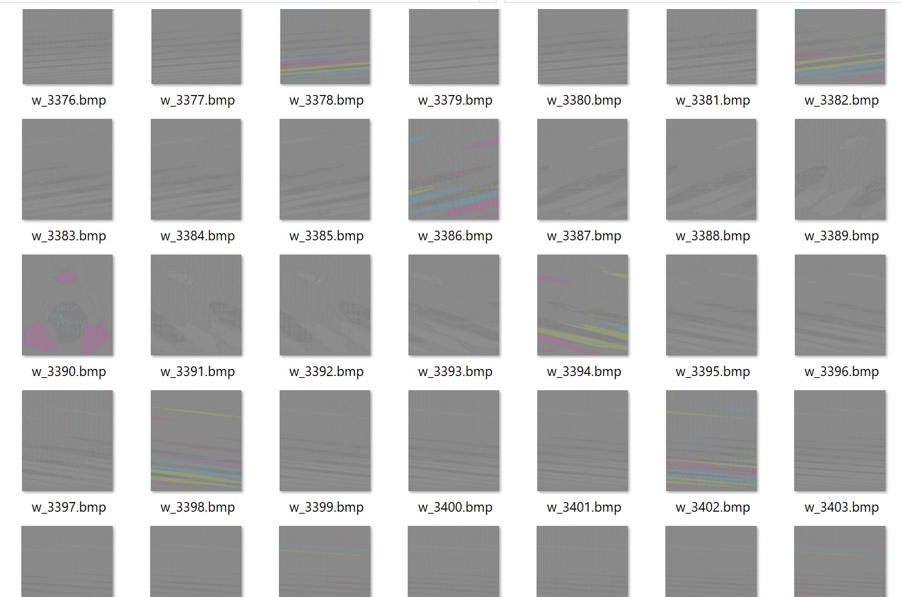

# Solution for ECB Penguin

## Solution

- Recreate a BMP file header so that image renderers can render and display image.
- Bruteforce the width and height values (in the BMP header)
    - Process can be optimised by guessing size of image (check out 5th link)
- Replace the header and render the images, and find for the image with Tux the Penguin!

## Solve script

Solve script: [solve.py](solve.py)

Screenshot of solve script output:  

Possible resultant image:  

## Useful links

- https://en.wikipedia.org/wiki/BMP_file_format#File_structure
- https://docs.fileformat.com/image/bmp/
- https://words.filippo.io/the-ecb-penguin/
- https://crypto.stackexchange.com/questions/14487/can-someone-explain-the-ecb-penguin
- https://crypto.stackexchange.com/questions/63145/variation-on-the-ecb-penguin-problem
