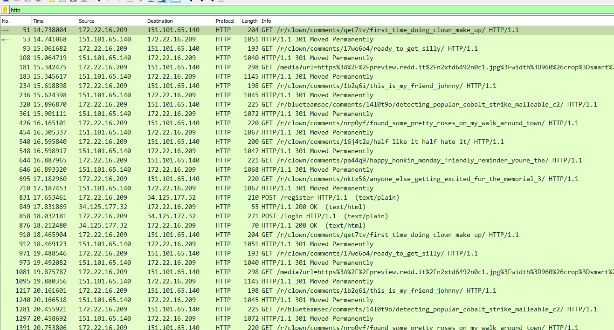
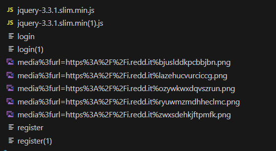
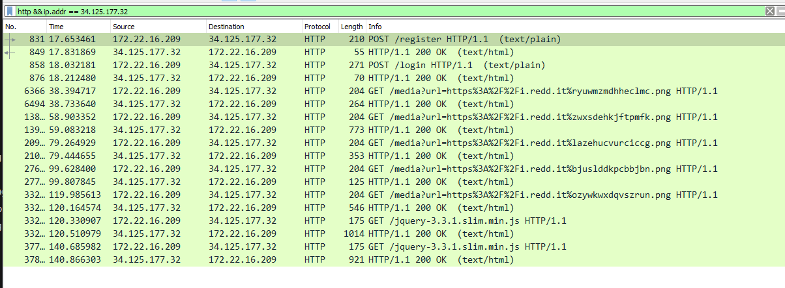
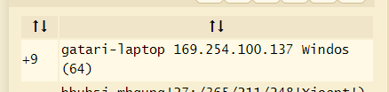

# monkey_C_monkey_2
An APT group, known as "monkey-C-monkey-2", has targeted our company and successfully launched a ransomware operation on one of our employees. We have managed to recover a stageless binary that was dropped onto our server, as well as a network capture of the attack.

Unfortunately, we were unable to locate any identify the malicious traffic in the network capture and have made little progress in decrypting our files. However, our threat intelligence tells us that this group is known to use a concept known as Malleable C2, which allows them to disguise their network traffic as legitimate traffic.

Could you help us find out how to decrypt our files?

## Writeup
We're gonna solve this challenge without re-ing the binary, but re-ing the binary makes this challenge a lot more fun.

### Step 1
Let's start by analyzing the web traffic in the pcap, we're told that the group likes to implement Malleable C2. 

This is an employee of the company, so we can expect Malleable C2 to be implemented in HTTP / HTTPS traffic, but we can always turn back and look at other protocols if we don't find anything.

We find a bunch of HTTP requests that make GET requests to various reddit pages:



### Step 2
Instead of manually looking through hundreds of HTTP requests, we can iterate over it using `pyshark` and identify unique headers that are used in the HTTP requests.

First, we can find the unique IP addresses that made HTTP requests:
```python
import pyshark

def get_unique_http_ips( file_path: str ):
    capture = pyshark.FileCapture( file_path, display_filter='http' )

    unique_ips = set()

    for packet in capture:
        try:
            if 'IP' in packet:
                src_ip = packet.ip.src
                dst_ip = packet.ip.dst
                unique_ips.add( src_ip )
                unique_ips.add( dst_ip )
        except AttributeError:
            pass

    capture.close()
    return list( unique_ips )

file_path = '../dist/capture.pcapng'
unique_ips = get_unique_http_ips( file_path )
print( f"Found {len(unique_ips)} unique IPs that made HTTP requests" )
print( unique_ips )
```

Output
```
Found 5 unique IPs that made HTTP requests
['151.101.65.140', '151.101.193.140', '151.101.1.140', '151.101.129.140', '34.125.177.32']
```

### Step 3
Now that we have the unique IPs, we can iterate over the HTTP requests and find the unique headers:
```python
def parse_packets( file_path: str, ip: str ):
    capture = pyshark.FileCapture( file_path, display_filter=f'ip.addr == {ip} && http' )
    packet_details = []

    for packet in capture:
        try:
            if 'HTTP' in packet:
                http_layer = packet.http
                packet_info = { "ip": ip, "details": {} }

                if hasattr( http_layer, 'request_method' ):
                    packet_info[ "details" ][ "request_method" ] = http_layer.request_method

                if hasattr( http_layer, 'user-agent' ):
                    packet_info[ "details" ][ "user-agent" ] = http_layer.user_agent

                if hasattr( http_layer, 'response_code' ):
                    if hasattr( http_layer, 'response_phrase' ):
                        packet_info[ "details" ][ "server" ] = http_layer.server

                packet_details.append( packet_info )

        except Exception as e:
            print( str( e ) )

    capture.close()

    unique = {}
    for packet in packet_details:
        ip = packet[ "ip" ]
        details = packet[ "details" ]

        if ip not in unique:
            unique[ ip ] = { "user-agents": set(), "request_methods": set(), "servers": set() }

        if "user-agent" in details:
            unique[ ip ][ "user-agents" ].add( details[ "user-agent" ] )

        if "request_method" in details:
            unique[ ip ][ "request_methods" ].add( details[ "request_method" ] )

        if "server" in details:
            unique[ ip ][ "servers" ].add( details[ "server" ] )

    return unique

if __name__ == "__main__":
    file_path = '../dist/capture.pcapng'
    # unique_ips = get_unique_http_ips( file_path )
    # print( f"Found {len(unique_ips)} unique IPs that made HTTP requests" )
    # print( unique_ips )

    unique_ips = [ '151.101.65.140', '151.101.193.140', '151.101.1.140', '151.101.129.140', '34.125.177.32' ]

    for ip in unique_ips:
        packets = parse_packets( file_path, ip )
        print( f"IP: {ip}" )
        print( f"User-agents: {packets[ ip ][ 'user-agents' ]}" )
        print( f"Request methods: {packets[ ip ][ 'request_methods' ]}" )
        print( f"Servers: {packets[ ip ][ 'servers' ]}" )
        print( "" )

```

Output
```
IP: 151.101.65.140
User-agents: {'Go-http-client/1.1'}
Request methods: {'GET'}
Servers: {'snooserv'}

IP: 151.101.193.140
User-agents: {'Go-http-client/1.1'}
Request methods: {'GET'}
Servers: {'snooserv'}

IP: 151.101.1.140
User-agents: {'Go-http-client/1.1'}
Request methods: {'GET'}
Servers: {'snooserv'}

IP: 151.101.129.140
User-agents: {'Go-http-client/1.1'}
Request methods: {'GET'}
Servers: {'snooserv'}

IP: 34.125.177.32
User-agents: {'Go-http-client/1.1', 'Mozilla/5.0 (Windows NT 10.0; Win64; x64; rv:87.0)'}
Request methods: {'POST', 'GET'}
Servers: {'Werkzeug/3.0.1 Python/3.9.2'}
```

One of these really aren't like the others... It's pretty safe to assume that the IP `34.125.177.32` is probably the HTTP listener for the teamserver.

### Step 4
Now that we have the IP of the teamserver, we can look at the HTTP requests made to it and see if we can find anything interesting.

But once again, let's try do it programmatically after dumping all the HTTP requests made to the teamserver (File -> Export Objects -> HTTP -> Save All):

We see a bunch of exported data, most of it is encrypted so we'll need to identify the packets to get an idea of what's going on.



### Step 5
We can pretty easily identify the order of packets by simply looking at the order the packets come in lol


```python
def load_data( raw_folder: str ) -> dict[ str, bytes ]:
    order = {
        1: "register",
        2: "register(1)",
        3: "login",
        4: "login(1)",
        5: "media%3furl=https%3A%2F%2Fi.redd.it%ryuwmzmdhheclmc.png",
        6: "media%3furl=https%3A%2F%2Fi.redd.it%zwxsdehkjftpmfk.png",
        7: "media%3furl=https%3A%2F%2Fi.redd.it%lazehucvurciccg.png",
        8: "media%3furl=https%3A%2F%2Fi.redd.it%bjuslddkpcbbjbn.png",
        9: "media%3furl=https%3A%2F%2Fi.redd.it%ozywkwxdqvszrun.png",
        10: "jquery-3.3.1.slim.min.js",
        11: "jquery-3.3.1.slim.min.js(1)",
    }

    data = {}
    for file_name in os.listdir( raw_folder ):
        for order_num, order_name in order.items():
            if order_name == file_name:
                with open( os.path.join( raw_folder, file_name ), "rb" ) as f:
                    data[ order_num ] = f.read()

    return data

if __name__ == "__main__":
    data = load_data( "./raw" )

    # Print the order and contents of the first 3 packets:
    for i in range( 1, 4 ):
        print( f"Packet {i}: {data[i]}" )
```

Output
```
Packet 1: b'hello'
Packet 2: b'9'
Packet 3: b'woRwan1qe3I2dWp5fXh5KTo/Qjc7Pj03Ojk5Nzo8QClgcndteMKAfCkxwoE/PTLChg=='
```

### Step 6
Now that we have the order of the packets, we can start to analyze the data.

We can pretty safely assume that the first packet is beacon's initial check-in, and the second packet (usually) contains some sort of encryption routine for the beacon so subsequent packets can be encrypted.

And the third packet, would be what beacon sends back to the teamserver (likely details such as IP, hostname, architecture, etc.)

### Step 7
The contents of the third packet is obviously base64-encoded, so we can start by b64-decoding it.

```python
import base64

data = "woRwan1qe3I2dWp5fXh5KTo/Qjc7Pj03Ojk5Nzo8QClgcndteMKAfCkxwoE/PTLChg=="
data = base64.b64decode( data )
print( data.decode() )

```

Output
```
pj}j{r6ujy}xy):?B7;>=7:997:<@)`rwmx|)1?=2
```

Looks like gibberish, so let's just plop it into our favorite beginner CTF tool- dcode.fr cipher identifier and try all of the ciphers lol.


Well, that's pretty convenient.

```python
import base64


def shift( data: str, amt: int ) -> str:
    return "".join( [ chr( ord( c ) + amt ) for c in data ] )


data = "woRwan1qe3I2dWp5fXh5KTo/Qjc7Pj03Ojk5Nzo8QClgcndteMKAfCkxwoE/PTLChg=="
data = base64.b64decode( data )
print( data.decode() )

data = shift( data.decode(), -9 )
print( data )
```

Output
```
pj}j{r6ujy}xy):?B7;>=7:997:<@)`rwmx|)1?=2
{gatari-laptop 169.254.100.137 Windows (x64)}
```

### Step 8
We can see that the beacon is running on a Windows machine, and the hostname is `gatari-laptop` with an IP of `169.254.100.137`.

Since everything past the 5th packet is really _really_ long gibberish, let's just try to decode the 3rd and 4th (encrypted) packets and see if we can find anything interesting.

```python
if __name__ == "__main__":
    data = load_data( "./raw" )

    TARGET = [ 3, 4 ]
    SHIFT = 9

    for target in TARGET:
        decoded = shift( base64.b64decode( data[ target ] ).decode(), -SHIFT )
        print( f"Packet {target}: {decoded}" )
```

Output
```
Packet 3: {gatari-laptop 169.254.100.137 Windows (x64)}
Packet 4: sleep | 20
```

### Step 9
We can see that the 4th packet is a beacon configuration to sleep for 20 seconds, this isn't particularly useful. Anyway, we can move on to the long gibberish packets.

They appear to be images, from [Horimiya](https://myanimelist.net/anime/42897/Horimiya) (this has no relevance to the challenge, just thought it was funny)


Clearly the attacker doesn't like stego he made this part as easy as possible for us to reverse! Simply dump the packet contents and read the last line :)

```python
if __name__ == "__main__":
    data = load_data( "./raw" )

    print( data[ 5 ] )
```

Output
```
[SNIP]
\x9f\xedk\xa7eQ\xd3\x82\x93\x1e\x1a\x8fvV\xad\x83\xa9\xf5\xb1\xfd\xf8\xa3\x15\x15\xfe\xf2\x1fw\xf5\xb2\xfc\xd8\xb2\xf6\x8a?\xff\xd9 ||woBxeGp2cg=='
```

### Step 10
I wonder what that base64 string is... and so conveniently placed after leading " || " characters, wow!

Let's re-run the same decryption routine on it:
```python
if __name__ == "__main__":
    data = load_data( "./raw" )
    SHIFT = 9

    hmm = data[ 5 ].split( b"||" )[ -1 ]
    print( f"1: {hmm}" )

    hmm2 = shift(base64.b64decode( hmm ).decode(), -SHIFT)
    print( f"2: {hmm2}" )
```

Output
```
1: b'woBxeGp2cg=='
2: whoami
```

### Step 11
Now that we have confirmed how the beacon communicates with the teamserver, we can start to look at the other packets.
```python
if __name__ == "__main__":
    data = load_data( "./raw" )
    SHIFT = 9

    for i in range( len( data ) ):
        try:
            enc = data[ i + 1 ].split( b"||" )[ -1 ]
            dec = shift( base64.b64decode( enc ).decode(), -SHIFT )
            print( f"Packet {i + 1}: {dec}" )
        except:
            print( f"Packet {i + 1}: {data[ i + 1 ].decode()}" )
```

Output
```
Packet 1: hello
Packet 2: 9
Packet 3: {gatari-laptop 169.254.100.137 Windows (x64)}
Packet 4: sleep | 20
Packet 5: whoami
Packet 6: ls
Packet 7: whoami /all
Packet 8: ipconfig /all
Packet 9: profile |/jquery-3.3.1.slim.min.js
Packet 10: ls
Packet 11: XOR |zzmP9zzmP9
```

### Step 12
We can see that the 11th packet is a XOR operation, and the key is `zzmP9zzmP9`. That's probably the ransomware routine key, so let's try to decrypt the flag with it.

```python
def decrypt( data: bytes, key: bytes ) -> bytes:
    return bytes( d ^ key[ i % len( key ) ] for i, d in enumerate( data ) )
    # This is just XOR ^^

with open( "flag.txt.enc", "r" ) as f:
    ct = f.read()

KEY = "zzmP9zzmP9"
print( decrypt( ct, KEY ) )
```

Output
```
LNC24{mOnKeY_sEe_M0nkey_7p0_7f7ad80dafbd28f2301ae37a8e0684a9}
```

### Takeaways
This challenge was intended to be a beginner-intermediate level challenge that introduces the concept of Malleable C2 and how adversaries hide their malicious operations with legitimate traffic. 

The majority of the writeup was done programmatically and purely analyzing HTTP traffic, but you could also reverse the binary and find the C2 profile that way and skip all of the HTTP analysis.

### Full Solve Script
```python
import os
import base64
import pyshark

def parse_packets( file_path: str, ip: str ):
    capture = pyshark.FileCapture( file_path, display_filter=f'ip.addr == {ip} && http' )
    packet_details = []

    for packet in capture:
        try:
            if 'HTTP' in packet:
                http_layer = packet.http
                packet_info = { "ip": ip, "details": {} }

                if hasattr( http_layer, 'request_method' ):
                    packet_info[ "details" ][ "request_method" ] = http_layer.request_method

                if hasattr( http_layer, 'user-agent' ):
                    packet_info[ "details" ][ "user-agent" ] = http_layer.user_agent

                if hasattr( http_layer, 'response_code' ):
                    if hasattr( http_layer, 'response_phrase' ):
                        packet_info[ "details" ][ "server" ] = http_layer.server

                packet_details.append( packet_info )

        except Exception as e:
            print( str( e ) )

    capture.close()

    unique = {}
    for packet in packet_details:
        ip = packet[ "ip" ]
        details = packet[ "details" ]

        if ip not in unique:
            unique[ ip ] = { "user-agents": set(), "request_methods": set(), "servers": set() }

        if "user-agent" in details:
            unique[ ip ][ "user-agents" ].add( details[ "user-agent" ] )

        if "request_method" in details:
            unique[ ip ][ "request_methods" ].add( details[ "request_method" ] )

        if "server" in details:
            unique[ ip ][ "servers" ].add( details[ "server" ] )

    return unique


def get_unique_http_ips( file_path: str ):
    capture = pyshark.FileCapture( file_path, display_filter='http' )

    unique_ips = set()

    for packet in capture:
        try:
            if 'IP' in packet:
                src_ip = packet.ip.src
                dst_ip = packet.ip.dst
                unique_ips.add( src_ip )
                unique_ips.add( dst_ip )
        except AttributeError:
            pass

    capture.close()
    return list( unique_ips )


def shift( data: str, amt: int ) -> str:
    return "".join( [ chr( ord( c ) + amt ) for c in data ] )


def decrypt( data: bytes, key: bytes ) -> bytes:
    return bytes( d ^ key[ i % len( key ) ] for i, d in enumerate( data ) )


def load_data( raw_folder: str ) -> dict[ str, bytes ]:
    order = {
        1: "register",
        2: "register(1)",
        3: "login",
        4: "login(1)",
        5: "media%3furl=https%3A%2F%2Fi.redd.it%ryuwmzmdhheclmc.png",
        6: "media%3furl=https%3A%2F%2Fi.redd.it%zwxsdehkjftpmfk.png",
        7: "media%3furl=https%3A%2F%2Fi.redd.it%lazehucvurciccg.png",
        8: "media%3furl=https%3A%2F%2Fi.redd.it%bjuslddkpcbbjbn.png",
        9: "media%3furl=https%3A%2F%2Fi.redd.it%ozywkwxdqvszrun.png",
        10: "jquery-3.3.1.slim.min.js",
        11: "jquery-3.3.1.slim.min(1).js",
    }

    data = {}
    for file_name in os.listdir( raw_folder ):
        for order_num, order_name in order.items():
            if order_name == file_name:
                with open( os.path.join( raw_folder, file_name ), "rb" ) as f:
                    data[ order_num ] = f.read()

    return data


if __name__ == "__main__":


    file_path = '../dist/capture.pcapng'
    unique_ips = get_unique_http_ips( file_path )
    print( f"Found {len(unique_ips)} unique IPs that made HTTP requests" )

    for ip in unique_ips:
        packets = parse_packets( file_path, ip )
        print( f"IP: {ip}" )
        print( f"User-agents: {packets[ ip ][ 'user-agents' ]}" )
        print( f"Request methods: {packets[ ip ][ 'request_methods' ]}" )
        print( f"Servers: {packets[ ip ][ 'servers' ]}" )
        print( "" )


    data = load_data( "./raw" )
    SHIFT = 9

    print( f"[-] Decoding packet 11..." )
    dec = shift( base64.b64decode( data[ 11 ].split( b"||" )[ -1 ] ).decode(), -SHIFT )
    print( f"[+] Decoded packet 11: {dec}" )

    print( f"[+] Found key: {dec.split('|')[1]}" )
    key = dec.split( '|' )[ 1 ]  # zzmP9zzmP9

    with open( "flag.txt.enc", "rb" ) as f:
        enc = f.read()
        flag = decrypt( enc, key.encode() )
        print( f"[+] Decrypted flag: {flag.decode()}" )
```

```

[-] Decoding packet 11...
[+] Decoded packet 11: XOR |zzmP9zzmP9
[+] Found key: zzmP9zzmP9
[+] Decrypted flag: LNC24{mOnKeY_sEe_M0nkey_7p0_7f7ad80dafbd28f2301ae37a8e0684a9}

```