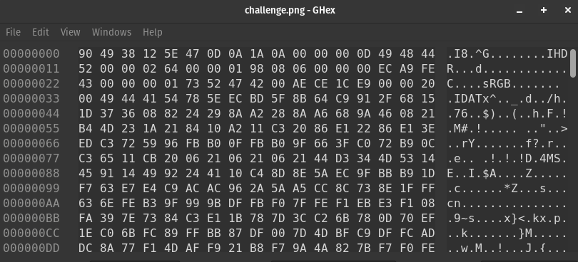

# Solution

1. The challenge file, `challenge.png` seems to be a regular PNG file until one tries to open it - it is a corrupted image. Start by analysing the corrupted image in a hex editor. A typical png header would look like `89 50 4E 47 0D 0A 1A 0A`, but what is seen when the file is opened in a hex editor is `90 49 38 12 5E 47 0D`
   
2. Compare the expected png header and the corrupted image's header and replace the corrupted bits/shift the bits to repair the image header. Now, the image will be recognised as a valid PNG file.
3. The fixed image is of a ship, and seems to be a regular image. However, the image file size is over 200kB and the image is of a low resolution. This indicates that there is something hidden in the image. Use `binwalk` to analyse the image.
   ```
   binwalk -e challenge.png
   ```
4. A hidden zip file is extracted. However, it is a password-protected file.
5. Going back to challenge.png, there is still one more hidden message hidden using the Least Significant Bit (LSB) technique.
6. One can use a decoder like [this online tool](https://stylesuxx.github.io/steganography/). Decoding it will give the string:

   ```
   I have captured your friends, and I won't let them go so easily. I guess I'll give you a clue, you won't be able to solve this challenge anyway.
   Password: AttackAtDawnTomorrow
   ```
7. Use the password to extract the zip file.
8. The zip file contains a text file which contains the message
```
Haha! Not so fast. I came, I saw, and I intercepted the message! But I've hidden it somewhere... in case I need the message again.
```
This message hints at the use of zero width steganography to hide the actual message. 

9. To decode the message hidden with zero width steganography, one would need to utilise a tool or script that can extract the hidden binary data. After decoding, one will obtain the binary form of the flag.
10. To retrieve the flag in plaintext, simply convert the binary to hexadecimal format.
