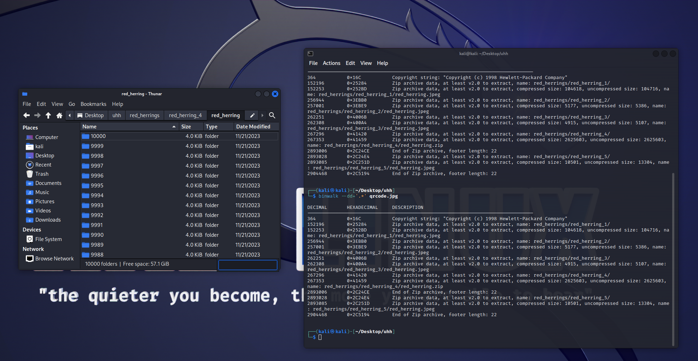

# Solution

the name of the challenge should be a red flag (pun intended) that the qr code is not the main focal point of the question. If you try to reconstruct the QR code, you will get a fake flag.

After noticing the size of the file, if you binwalk it you will see that it is hiding a couple of files inside.

extracting the folder inside you'll see that there are 5 files hidden inside of the zip

in red herring 4 there is another zip, which contains a zip file with 10k folders, each with fake flags.

either by writing code to filter, or manually searching for it (i dont think this will happen though.)

