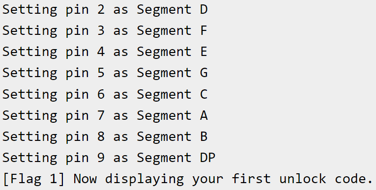
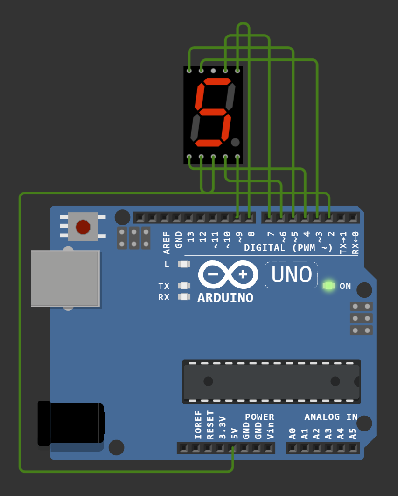

## Solution for Flag 1
- Download the .elf compiled firmware image and run it using the Wokwi Arduino Uno Simulator
- You can load the firmware in the simulator by hitting F1 and selecting "Upload firmware and start simulation"
- Once loaded, the serial output will show you how to reconstruct the circuit to get the flag

- Select a single seven-segment display component from the component list under "+"
- Wire it up according to the serial output, with the COM.1 pin of the display connected to the 5V pin of the Arduino Uno for power
- The flag will be displayed once the correct connections are made
- Flag 1: LNC24{7Hr0ugH_h0L3_5o1dEr1ng}

