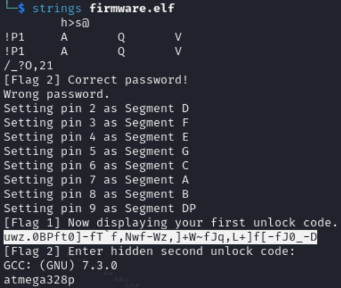
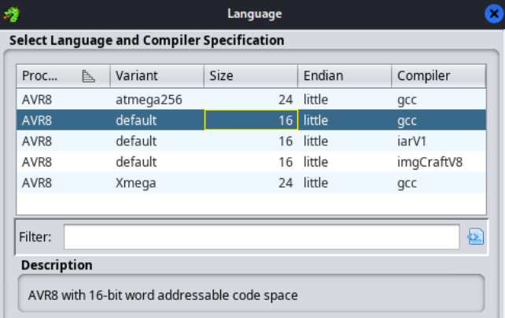
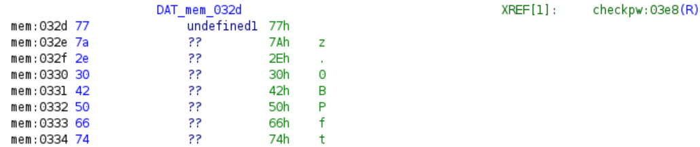
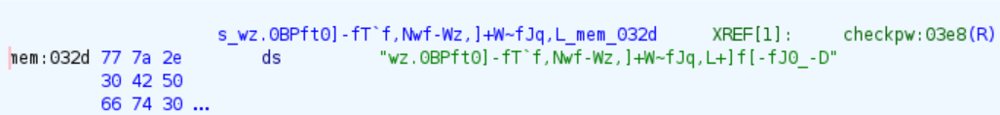
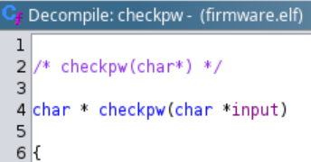
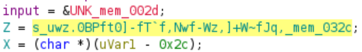
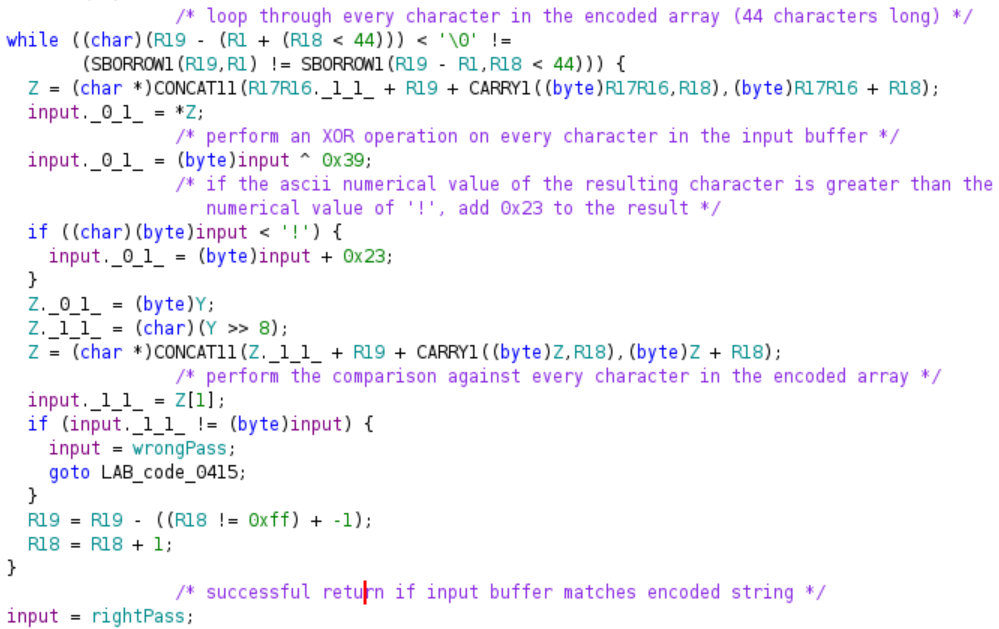
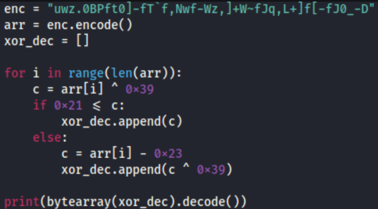

## Solution for Flag 2
- Interacting with the serial terminal will bring about the prompt "[Flag 2] Enter hidden second unlock code: "
- You will need to disassemble the .elf firmware image to reverse engineer the encoding scheme
- Perform the strings command on the firmware file and you will see an encoded string within
- You can also see the AVR microcontroller used for the Arduino Uno here (ATmega328P) and the compiler used (GCC)

- Open the firmware image in Ghidra and select the following architecture variant since it is the closest to the hardware

- Since the firmware was compiled with debugging symbols, the input checking function (checkpw) can be found in the Symbol Tree window
- Within the Defined Strings pane, the serial printouts for both the correct and wrong password are shown
- Clicking on them would show the XREF link to the checkpw function
- The encoded password is found within the memory location of the other defined strings, but you would need to define the array as a string since Ghidra does not recongnise it automatically as one

- Moving to the 'checkpw' function, you should see that it takes in the user input as a string for comparison

- The function loads the encoded password from memory into the variable Z before comparison

- Scrolling down to the encoding logic of the comparison function, you will find that the function loops 44 times, which is the length of the encoded password array 
- It takes in the input buffer array and does an XOR operation with 0x39 on every character of the input buffer
- If the result of the XOR operation is greater than the numerical value of the ascii character '!', the logic adds 0x23 to the result
- After the contents of the input buffer is encoded, the function performs a comparison against every character in the encoded password array
- It returns a successful result when the input buffer after encoding matches the encoded password

- After deciphering the encoding logic, the password can be decoded with the following python script
  

- Every character in the encoded password string is XOR-ed again with 0x39 to recover its original value
- If the result of the XOR operation is smaller than the ascii hex value of '!' (0x21), 0x23 is deducted from the result
- Flag 2: LNC24{i_M4d3_mY_0wN_3nC0d1nG_sH0u1d_b3_s4f3}

