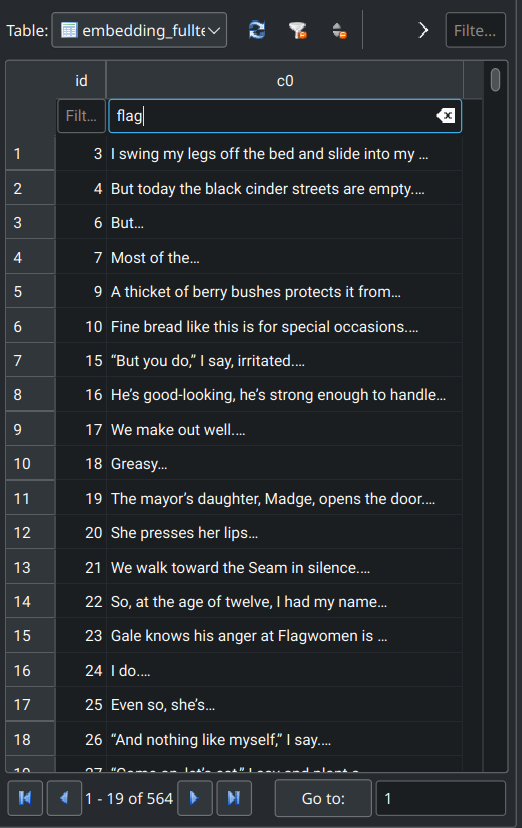
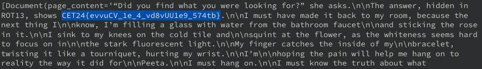
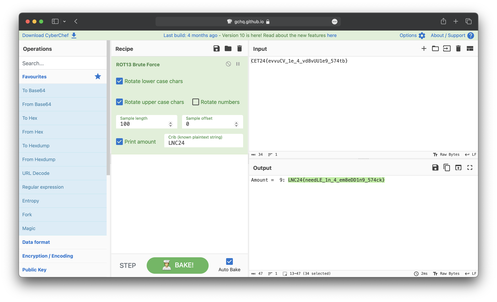

# Mockingjay Embeds Solution

1.  We are given a zip file, `mockingjay-embeds`. Unzipping the file would give a chroma.sqlite3 file.
2.  Opening the file in DB Browser for SQLite, we can see that there are thousands of entries in the table. Narrowing down to search for the flag, we can see that there are still many entries.

    

3.  Given that there are many entries, we can use an embedding function to do a semantic search for the flag. One such embedding function is the HuggingFaceBgeEmbeddings. The code for the embedding function is as follows:

    ```py
    from langchain.vectorstores.chroma import Chroma
    from langchain.embeddings import HuggingFaceBgeEmbeddings

    model_name = "BAAI/bge-small-en-v1.5"
    encode_kwargs = {'normalize_embeddings': True}

    embedding_function = HuggingFaceBgeEmbeddings(
        model_name=model_name,
        encode_kwargs=encode_kwargs,
    )
    ```

4.  Now, we can use the embedding function to query the database for the answer we are looking for.

    ```
    db = Chroma(persist_directory="./mockingjay-embeds", embedding_function=embedding_function)
    page_content = db.similarity_search("What is the solution?")[0].page_content
    ```

5.  The output of the code would be as follows:
    

    From this, we can see that the flag has been encoded with ROT13 with an unknown offset. Brute-forcing the encoded value on cyberchef would give us the flag.

    
