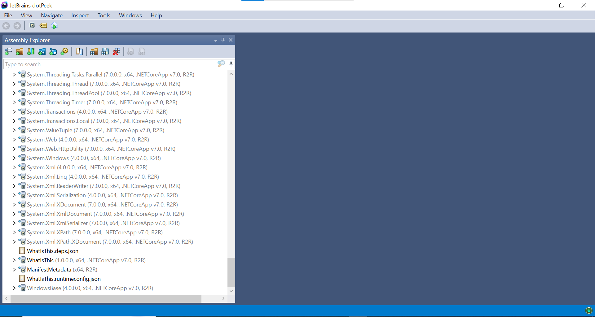
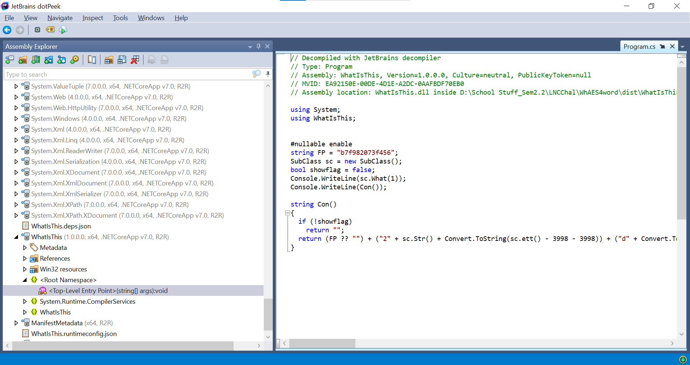
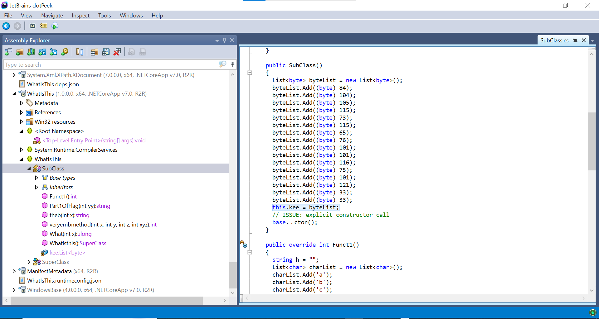
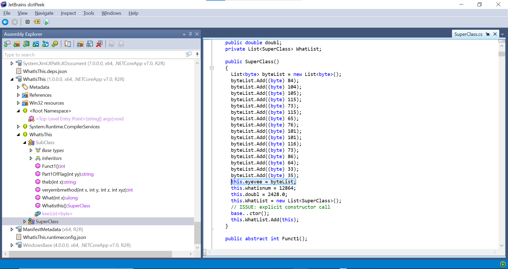
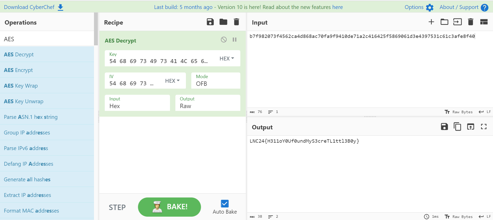

# How to solve WhAES4word?
## Tools
1. JetBrain DotPeek (.NET Framework Decompiler)

## Steps
1. Download the file
2. Identify the EXE type \
`strings WhatIsThis.exe | grep '.NET'`
> Output:
> ```
> ...
> .NETCoreApp,Version=v7.0
> .NET 7.0
> .NETCoreApp,Version=v7.0
> .NET 7.0
> .NETFrameworkAssembly
>  .NET
> .NETCoreApp,Version=v7.0
> .NET 7.0
> .NETFrameworkAssembly
> .NET
> .NETCoreApp,Version=v7.0
> .NET 7.0
> .NETFrameworkAssembly
> .NET
> .NETCoreApp,Version=v7.0
> .NET 7.0
> .NETFrameworkAssembly
> .NET
> .NETCoreApp,Version=v7.0
> .NET 7.0
> .NETFrameworkAssembly
> .NET
> .NETCoreApp,Version=v7.0
> .NET 7.0
> ...
> ```
3. Use a decompiler like DotPeek to decompile the .NET Framework based EXE File.
   
   Select the WhatIsThis module and open it.
4. Reverse the following obfuscated code (from root namespace), and locate the appropriate classes, and get the main encrypted flag
   
> ```csharp
> // Decompiled with JetBrains decompiler
> // Type: Program
> // Assembly: WhatIsThis, Version=1.0.0.0, Culture=neutral, PublicKeyToken=null
> // MVID: EA92150E-00DE-4D1E-A2DC-0AAFBDF70EB0
> // Assembly location: WhatIsThis.dll inside D:\School Stuff_Sem2.2\LNCChal\WhAES4word\dist\WhatIsThis.exe)
> 
> using System;
> using WhatIsThis;
> 
> 
> #nullable enable
> string FP = "b7f982073f456";
> SubClass sc = new SubClass();
> bool showflag = false;
> Console.WriteLine(sc.What(1));
> Console.WriteLine(Con());
> 
> string Con()
> {
>   if (!showflag)
>     return "";
>   return (FP ?? "") + ("2" + sc.Str() + Convert.ToString(sc.ett() - 3998 - 3998)) + ("d" + Convert.ToString(sc.FakeFirstLetterofFlag() + 86) + sc.snd()) + sc.MemeBigBoi() + "de71a2c41" + (sc.SupDudes() + sc.IDK() + "f5") + Convert.ToString(sc.veryembmethod(1, 2, 3, 4) - 13094) + (Convert.ToString(sc.veryembmethod(-99999, 11112, 3344, 122) - 99999) + "d" + Convert.ToString(sc.veryembmethod(-99999, 11112, 3344, 122) - 99997) + "e") + (Convert.ToString(sc.veryembmethod(-99999, 11112, 3344, 122) + 4297531) + "c") + sc.theb(61) + sc.finalcheck();
> }
> 
> ```
5. You will acquire the encrypted flag after deobfuscating and decoding the code.
```b7f982073f4562ca4d868ac70fa9f9410de71a2c416425f5869061d3e4397531c61c3afe8f40```
6. As given as a hint from the title, it uses an AES Encryption, which requires Key and IV to decrypt the ciphertext. Explore the classes of the file, and find the variables "kee" and "eyevee".
   
   
   Key in bytes: ```[84,104,105,115,73,115,65,76,101,101,116,75,101,121,33]```
   IV in bytes: ```[84,104,105,115,73,115,65,76,101,101,116,73,86,64,33,35]```
7. Turn the bytes into hex (python) (for both Key and IV)
>   ```python
>   for i in [84,104,105,115,73,115,65,76,101,101,116,75,101,121,33]:
>     print(hex(i))
>   ``` 
Output:
> ```
> 0x54
> 0x68
> 0x69
> 0x73
> 0x49
> 0x73
> 0x41
> 0x4c
> 0x65
> 0x65
> 0x74
> 0x4b
> 0x65
> 0x79
> 0x21
> ```
Key: ```54 68 69 73 49 73 41 4C 65 65 74 4B 65 79 21 21 ``` \
IV: ```54 68 69 73 49 73 41 4C 65 65 74 49 56 40 21 23 ``` \
8. Use a tool like [CyberChef](https://gchq.github.io/CyberChef/) With OFB Mode.
   
You will end up with your flag of ```LNC24{H311oY0Uf0undMyS3creTL1ttl3B0y}  ```