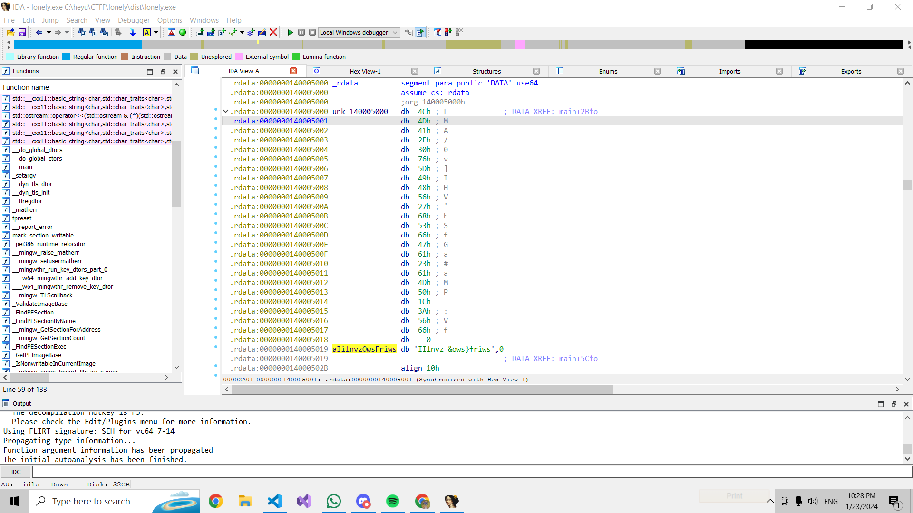
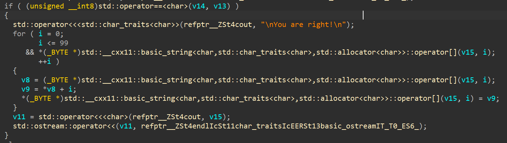

1. open the exe with any decompiler/debugger
2. find flag "LMA/0v]IHV'hSfGa#aMP:Vf"

3. look down abit more and find the way the flag/phrase is decoded in the if loop

4. now decrypt with `print(bytes([i+ord(j)for(i,j)in enumerate("LMA/0v]IHV'hSfGa#aMP:Vf")]))`

note: another way is to get the key but doing the flag is easier if one knows debugger, the way is to bruteforce the key by entering each digit to compare with the output and slowly find the key