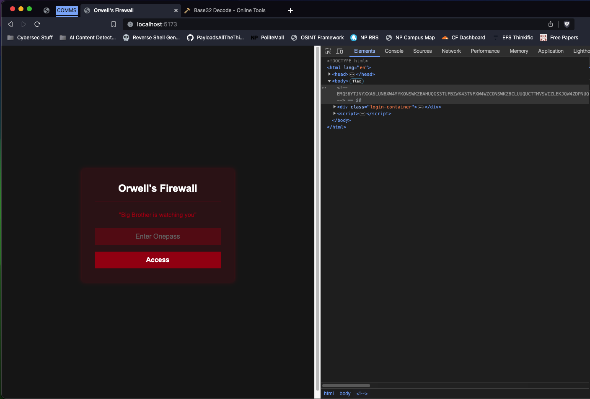
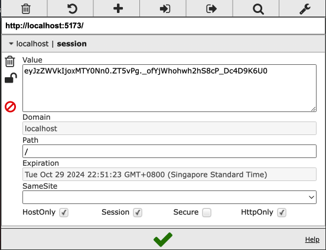
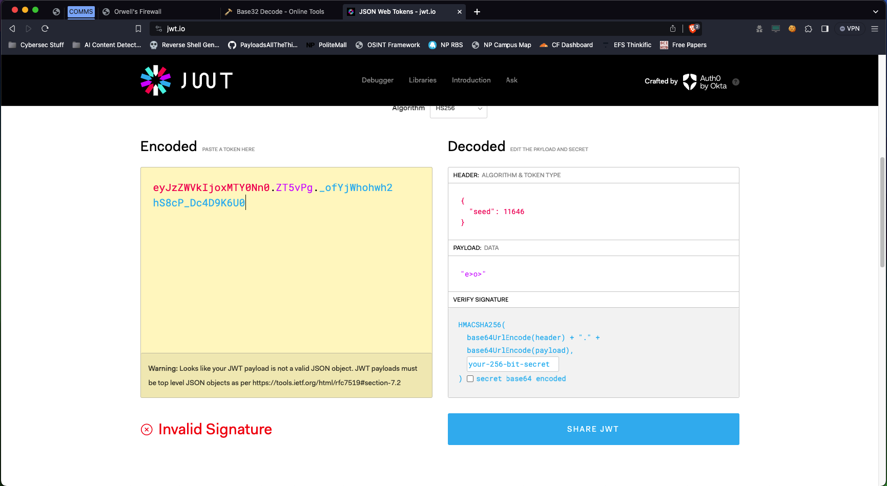
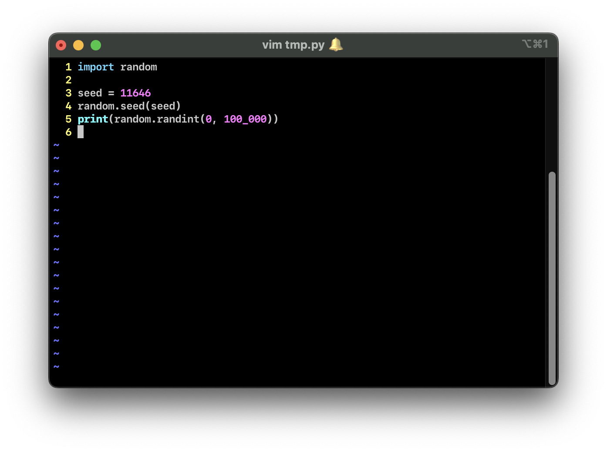
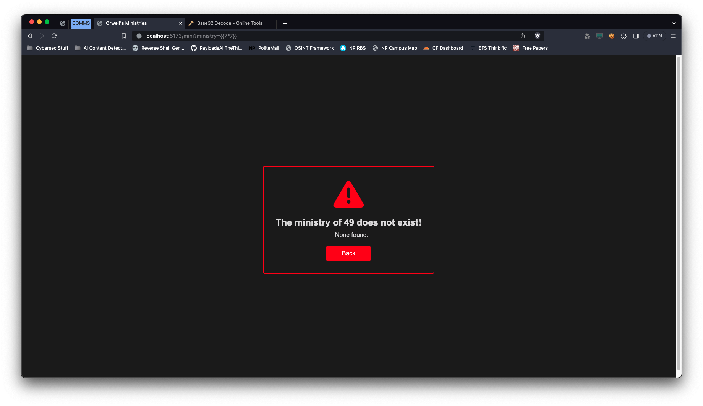
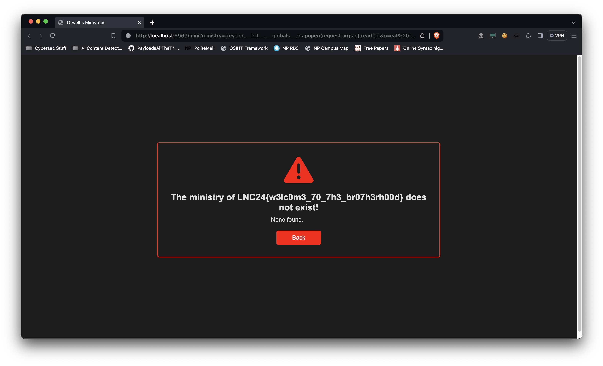

# Orwell's Firewall

This challenge is based of George Orwell's dystopian novel, 1984. Most
characters and words are taken from the book.

---

## Part I - Breaking the "Random" Number Generator

When the user opens the site, they are greeted with a simple login prompt.

The prompt does not reveal much, but a quick view of the HTML source reveals a base32
encoded comment.

`EMQS6YTJNYXXA6LUNBXW4MYKONSWKZBAHUQGS3TUFBZWK43TNFXW4WZCONSWKZBCLUUQUCTTMVSWIZLEKJQW4ZDPNUQD2IDSMFXGI33NFZJGC3TEN5WSQ43FMVSCSCTHMVXGK4TBORSWIIB5EBZWKZLEMVSFEYLOMRXW2LTSMFXGI2LOOQUDALBAGEYDAMBQGAUQUCTTMVZXG2LPNZNSE43FMVSCEXJAHUQGOZLOMVZGC5DFMQFAU2LGEBTXKZLTOMQD2PJAM5SW4ZLSMF2GKZB2BIQCAIBAONSXG43JN5XFWITJNZZXIYLUMURF2IB5EBKHE5LFBIQCAIBAOJSXI5LSNYQCEQ3POJZGKY3UEERAUZLMONSTUCRAEAQCA4TFOR2XE3RAOJSWI2LSMVRXIKDVOJWF6ZTPOIUCO3LBNFXC42LOMRSXQJZMEBSXE4TPOI6SESLOMNXXE4TFMN2CAT3OMVYGC43TEBSW45DFOJSWIIJCFEUQ====`



When decoded, it evaluates to:

```py
#!/bin/python3
seed = int(session["seed"])

seededRandom = random.Random(seed)
generated = seededRandom.randint(0, 100000)

session["seed"] = generated

if guess == generated:
    session["instate"] = True
    return "Correct!"
else:
    return redirect(url_for('main.index', error="Incorrect Onepass entered!"))
```

Upon closer inspection, we see that a `seed` is obtained from the user session, and fed
into Python's `random` module. A number between `0` and `100,000` is generated. Given the same
seed, the next number generated would always be the same, i.e.: Given a seed of `10`, the next
number is guaranteed to be `74,894`.

Using this, we can decode the session cookie from our browser (it's base64 encoded).





After getting the value of the seed, we can use it to seed Python's
`random` module. We can then call `random.randint()`
and get the next number, and gain access to part 2.



## Part II - Server Side Template Injection

After gaining access, the user is presented with a list of ministries.
Clicking on one sends a request to `/mini?ministry=name`. The `ministry`
parameter is vulnerable to server side template injection, which means that
any valid templating code, written between 2 curly braces `{{}}`, would be
executed by the server.

For example, when the user puts in `{{ 7 * 7 }}`, the server would display
`49` instead.



To make this challenge harder, specific character such as `[]`, `'`, `"`
and spaces are not allowed. Payloads that are normally found online cannot
be used to solve this challenge.

## Part III - SSTI Blacklist Override

Since spaces are not allowed, it's almost impossible to read the flag
as the command `cat flag.txt` has a space. Only the `ministry` parameter
is matched against the blacklist. In order to solve this, we can leverage
another parameter to add spaces and access it using `request.args`.

The final payload would be:
`?ministry={{cycler.__init__.__globals__.os.popen(request.args.p).read()}}&p=cat%20flag.txt`

The first part, `cycler...` can be found from [here](https://github.com/swisskyrepo/PayloadsAllTheThings/blob/master/Server%20Side%20Template%20Injection/README.md#jinja2).

The second part is an implementation of the solution mentioned above.


